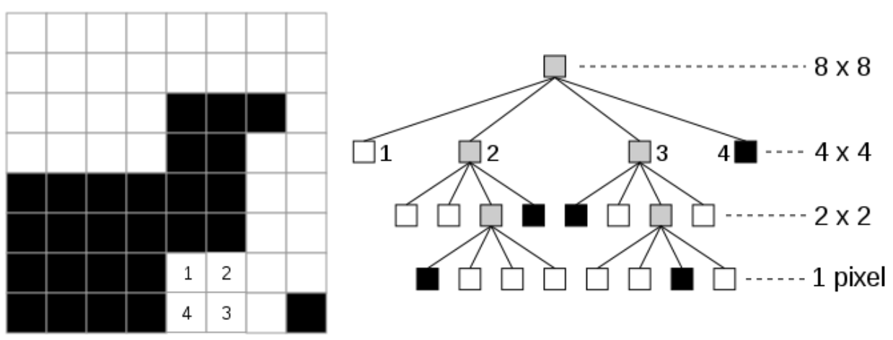
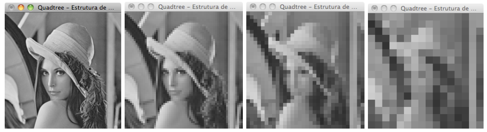

[](https://classroom.github.com/online_ide?assignment_repo_id=8067558&assignment_repo_type=AssignmentRepo)
# Atividade 3 - Quadtree

## Objetivos da Atividade:
	
O objetivo principal do trabalho é aplicar os conceitos de Tipos Abstratos de Dados (TAD) Hierárquico, ou seja, Árvore [1][2][3] apresentados em sala de aula, no contexto de um problema real e prático.

A implementação do TAD deverá ser integrada ao problema e uma solução computacional codificada em linguagem C++.

## Motivação:

Estruturas de dados baseadas em árvores [1] são muito aplicadas em área que trabalham com informações organizadas espacialmente e sobre as quais pretende-se aplicar algum tipo de  estruturação hierárquica. Um exemplo é o uso de árvores aplicadas a algoritmos de compressão de dados. Algoritmos com a codificação de Huffman [3] constroem uma estrutura de árvore binária para definir uma codificação de tamanho variável, baseada na freqüência dos símbolos em um texto. Dessa forma, códigos de menor tamanho são associados aos símbolos de maior freqüência, reduzindo assim o espaço de armazenamento do texto.

Um principio semelhante pode ser utilizado na compressão de imagens. Nesse caso, como uma imagem é uma estrutura bi-dimensional, o espaço deve ser dividido em 2 dimensões, horizontal e vertical, dando origem a uma árvore quaternária ou comumente chamada de quadtree [4]. A Figura 1 mostra uma quadtree gerada a partir de uma imagem de 8x8 pixels.
  
 
  
Como podemos ver na Figura 1, a estrutura da quadtree representa uma subdivisão recursiva da imagem em subimagens, de dimensões reduzidas a 1/4 da imagem original a cada novo nível da árvore. Portanto, a raiz da árvore representa a imagem original 8x8. No nível seguinte temos 4 subimagens, cada uma com dimensão 4x4, representando a subdivisão da imagem original em 4 quadrantes. A cada novo nível o processo de repete, até que a dimensão da imagem se reduza a um único pixel (folha da árvore).

O processo descrito acima dá origem a uma árvore completa, onde todas as folhas conterão a informação de um pixel. No entanto, analisando ainda a Figura 1, vemos que tão logo uma subimagem seja detectada como contendo uma única informação (todos os pixels pretos ou brancos) o processo de subdivisão pode ser abortado. Podemos ver claramente que é o caso dos filhos mais a esquerda e mais a direita do nó raiz, que correspondem, respectivamente, aos quadrantes superior esquerdo e inferior esquerdo. É ai que a compressão ocorre: toda uma região que possui a mesma informação é “resumida” a um único nó da estrutura, evitando a repetição da informação dos pixels dessa região.

Vale notar que como temos associados a cada nó 4 filhos, há que se estabelecer um padrão para alocação dos filhos de um nó. Na Figura 1 podemos observar o padrão estabelecido pela numeração (1,2,3,4) na imagem 8x8. Ou seja, da esquerda para a direita, os filhos de um nó vão corresponder sempre aos quadrantes superior esquerdo (1), superior direito (2), inferior direito (3) e inferior esquerdo (4). Essa ordem deve ser mantida durante todo o processo para garantir a consistência da estrutura. 

Note também que no exemplo da Figura 1 a imagem é um bitmap, ou seja, um mapa de bits, onde cada pixel possui apenas 2 tons de cores: preto (0) ou branco (1). Em uma imagem real (ainda sem cor), temos uma variação de tons de cinza, tipicamente representada por um byte por pixel. Ou seja, a cada pixel da imagem temos a possibilidade de representar um valor de tom de cinza entre 0 (preto) e 255 (branco). Em uma situação como essa, a obtenção de um  quadrante em que todos os pixels sejam exatamente iguais (como nos filhos (1) e (4) da raiz) é mínima. Nesse caso trabalhamos com a idéia de similaridade entre os pixels da região analisada. Caso, em um quadrante, todos os pixels sejam “parecidos”, ou seja, próximos de uma mesmo valor, podemos considerar que aquele  quadrante pode ser “comprimido” por esse “valor próximo”. 

Você provavelmente já deve estar imaginando que a forma mais fácil de saber se os pixels são “parecidos” é calcular o valor de tom de cinza médio da região (média aritmética dos pixels) e comparar o erro percentual na substituição de cada pixel pela media do quadrante. Se esse erro estiver abaixo de um certo limiar (5%, por exemplo) podemos substituir toda a região pela sua cor média, caso contrário, significa que precisamos prosseguir na subdivisão em quadrantes, para avaliar as subimagens seguintes. 

## O Problema:

Considerando o exposto acima, seu trabalho será, baseado no código fonte base fornecido pelo professor, implementar um programa que construa uma estrutura de quadtree associada a uma imagem em tons de cinza, com o propósito de compacta-la. 

A imagem é armazenada na aplicação pela variável imageGray como uma matriz de bytes (unsigned char) alocada dinamicamente pela rotina de conversão para tons de cinza. Sua dimensão é armazenada por duas variáveis inteiras iHeight e iWidth. Todas essas variáveis são globais. 
	
Um programa base será fornecido pelo professor, que trata da apresentação da imagem na tela e no controle das rotinas de desenho. Esse programa inicia mostrando a imagem original. Voce deverá estende-lo para que, através do teclado, o usuário seja capaz de visualizar a imagem de duas formas distintas:

- A representação da imagem a partir de um certo nível da quadtree completa. O nível pode ser ampliado ou reduzido de forma iterativa (Figura 2);
- A representação da imagem comprimida para um determinado valor de erro percentual. O valor do erro deve ser incrementado ou decrementado em intervalos de 5%.

 

## A Implementação:

A implementação deve ser feita em linguagem C++ ANSI (independente de qualquer IDE ou SO) e tomar por base o código fonte base fornecido pelo professor. Esse código fonte já possui alguns módulos, a saber:

- winGL.* 
Rotinas responsáveis pelo controle das janelas e dos desenhos, baseadas nas bibliotecas OpenGL e freeglut[6][7][8][9];
- no diretorio SOIL [5] 
Rotinas responsáveis pela leitura de uma imagem, em diversos formatos, colorida (3 bytes por pixel - RGB), e sua conversão para uma imagem em tons de cinza (1 byte por pixel - tons de cinza); 
- compressao.*
Programa principal e rotinas de tratamento de eventos de teclado, mouse e desenho [10].
- no diretório IMGs
Banco de imagens que você deve utilizar para rodar seu programa.

Os trabalhos deverão ser desenvolvidos individualmente. O código fonte gerado deve ser comentado e legível. Acompanhando o código fonte um breve relatório técnico (README) deve ser produzido, descrevendo o uso do programa e uma analise da complexidade dos algoritmos desenvolvidos (relacionados as operações sobre a árvore).

## A Avaliação:

Seu programa será avaliado pelos critérios:

| Critério | Pontuação |
| :--- | :---: |
| 1. Uso correto do conceito de TAD/Classes | 0,5 |
| 2. Uso correto do conceito de Modularização | 0,5 | 
| 3. Analise de Complexidade dos algoritmos (README) | 1,0 |
| 4. Geração da quadtree | 2,5 |
| 5. Visualização da imagem comprimida por nível | 2,5 |
| 6. Visualização da imagem comprimida por limiar | 3,0 |

## Penalidades:              

> Será aplicada a penalização de -1,0 pto por dia de atraso (verificado via data da ultima submissão no repositório)
> A cooperação entre alunos é considerada salutar. No entanto, trabalhos com alto grau de similaridade serão tratados como “plágio”.
> 
> **Em casos de plágio (total ou parcial) todos os envolvidos terão suas avaliações zeradas**. 

Qualquer dúvida adicional, evite problemas: não presuma nada, procure o professor para esclarecimentos.

# Referencias Bibliográficas:

[1]	Ziviani, Nivio. Projeto de Algoritmos: com Implementações em Pascal e C. Vol. 2. Thomson, 2004.

[2]	Cormen, T. H., Leiserson, C. E., Rivest, R. L., & Stein, C. Introdução a algoritmos. 2001.

[3]	Sedgewick, Robert. Algorithms in C++. Pearson Education, 2003.

[4]	Samet, Hanan. “The Quadtree and Related Hierarchical Data Structures.” ACM Comput. Surv. 16 (1984): 187-260.

[5]	Simple OpenGL Image Library, disponível em: http://www.lonesock.net/soil.html 

[6]	Marco Antonio G. Carvalho, Instalação da biblioteca OpenGL no Dev-C++, 2006, disponível em: http://www.ft.unicamp.br/~magic/opengl/instala-windows.html 

[7]	Instalar glut no CodeBlocks, 2012, disponível em: http://opengl-ms.blogspot.com.br/2012/08/instalar-glut-no-codeblocks.html 

[8]	Nícolas Roque dos Santos, Guia de instalação - OpenGL, GLUT e GLEW. disponível em: https://edisciplinas.usp.br/pluginfile.php/4264396/mod_resource/content/1/guia-de-instalacao.pdf

[9] Freeglut Windows Development, disponível em: https://www.transmissionzero.co.uk/software/freeglut-devel/

[10] Isabel Harb Manssour, "Introdução à OpenGL", https://www.inf.pucrs.br/~manssour/OpenGL/PrimeiroPrograma.html


# **Compressão**

### **Por que compactar:**

- Otimização de espaço ==> Busca certificar-se de que os dados sejam armazenados da maneira mais econômica possível.

### **O que pode ser compactado:**

- Textos, imagens, áudios ou informações com redundância.

    - Exemplo: 
        - Em textos podemos considerar como redundantes as letras que se repetem (algumas com mais frequência que outras);
        - Já nas imagens, podem ser consideradas a predominância das cores por região;
        - Em áudios podem ser consideradas as ausência de som em determinados trechos ou ainda frequências próximas de tons.

- Algoritmos de compressão buscam lidar com essa redundância. 

### **Tipos de compressão:**

- **Com perdas:** aumenta a redundância e, portanto, tende a aumentar a taxa de compressão. Como no processo de compressão algumas das informações originais são perdidas, a descompressão não resulta na mesmas informações originais, porém, o ideal é que essa perda seja mínima a finm de que a percepção do usuário sobre a informação não mude. 

    No caso da compressão de imagens, por exemplo, pixels de cores muito parecidas podem ser transformados em uma única cor (a mais predominante) que represente o tom que mais se aproxima da informação original.
    
    Em áudios podem haver perdas de trechos fora da zona audível ou que possuam frequência de tom muito próximas.

    - **Algumas desvantagens:**
        - Como dito anteriormente, a perda de dados nesse processo faz com que a descompressão não resulte no conjunto de informações exatamente igual ao original;

        - Se a imagem tiver muitas cores diferentes, a árvore pode ficar tão complexa que a imagem compactada ficará maior que a original

- **Sem perdas:** Ao contário do tipo acima, nesse caso o processo de descompressão resulta a informação comprimida com a mesma precisão da que foi dada originalment. Um dos algoritmos mais conhecidos para esse tipo de compressão é a Codificação de Huffman.


# **Árvores:**

### **Árvores Binárias (AB):**

De acordo com Zivian (2004, p. 158 _apud_ KNUTH, 1997), uma Árvore Binária (AB) consiste em um 

```
"conjunto finito de nós que está vazio ou consiste em um nó chamado raiz mais os elementos de duas árvores distintas chamadas de subárvores esquerda e direita do nó raiz."
```

Assim, no caso de um AB, cada nó tem no máximo duas outras subárvores.

### **Quadtree (ou Árvore Quadrantes):**

A definição acima aplica-se quase que inteiramente à uma Quadtree, com a diferença de que cada um dos seus nós têm quadro filhos, ao invés de apena dois como na AB.

Quadtrees "são comummente utilizadas para participar espaços com duas dimensões, subdividindo o espaço recursivamente em quatro quadrantes ou regiões. O dato associado com a folha pode variar de acordo com a aplicação, mas a folha representa uma _"unidade de informação espacial interessante"_" (tradução livre feita a partir do Wikipédia*)

``` 
* citação original:
most often used to partition a two-dimensional space by recursively subdividing it into four quadrants or regions. The data associated with a leaf cell varies by application, but the leaf cell represents a "unit of interesting spatial information"
```

Em outras palavras, a ideia de uma Quadtree é dividir o espaço em regiões (ou quadrantes) até que cada uma dessas regiões quase uma informação espacial relevante. No caso do problema em questão, estamos interessados em cada pixel individualmente.

Existem alguns tipos de Quadtree, tais como _Region Quadtree_, _Point QuadTree_, _PointRegion-Quadtree_, e outros. O problema proposto pode ser resolvido com uma **Region Quadtree** (ou, em tradução livre, Árvore Quadrante por Região).

# **Materiais consultados:**

### Configuração de ambiente (Windows):

- [6], [7], [8], [9], [10]

> Apesar de ter consultado os materiais acima, foi necessário realizar a instalação de uma distribuição Linux na máquina!

### Estruturas de dados, algoritmos & outros:

- ZIVIANI, Nivio. Projeto de Algoritmos: com Implementações em Pascal e C. Vol. 2. Thomson, 2004, p. 158.

- [Curso de C++ - Aula 53 - Árvore binária](https://www.youtube.com/watch?v=sEsGZtJdAts)

- [Algoritmos e Estruturas de Dados/Árvores Binárias](https://pt.wikibooks.org/wiki/Algoritmos_e_Estruturas_de_Dados/%C3%81rvores_Bin%C3%A1rias)

- [Quadtree - Wikipédia](https://en.wikipedia.org/wiki/Quadtree)

- [Quad Tree - Geeks for Geeks](https://www.geeksforgeeks.org/quad-tree/)

- [Introdução à Estrutura de Dados Espaciais & QuadTree](http://www.decom.ufop.br/guilherme/BCC203/geral/ed2_introducao-estruturas-dados-espaciais_victor.pdf)

- [Como a compressão de dados funciona? (Árvore de Huffman)](https://www.youtube.com/watch?v=-TonlL3vcGk)

- [Codificação de Huffman](https://www.youtube.com/watch?v=xQQt5myz00o)

- [How to Fix Error Makefile: *** missing separator. Stop](https://www.youtube.com/watch?v=2nM6DBE0blA)

-----

## **Compilar & executar:**

Com o compilador da sua preferência, será necessário compilar os seguintes arquivos `.cpp`: `winGL`, `cPonto`, `cNo`, `cQuadrante`, `cArvoreQuad` e `compressao`, que estão localizados no diretório `src`.

Se estiver usando ambiente Linux, basta entrar na basta `src` e executar o comando `make` e assim a ferramenta `Makefile` irá executar o script de compilação.

Usando o `g++`, por exemplo, você pode executar o seguinte comando para compilar esses arquivos:

-----

Após a compilação, digite o seguinte comando em seu terminal para que o programa seja executado:

> ./compressao

Lembrando que caso tenha dado outro nome ao executável ao invés de `main.exe`, deverá executar com o nome que foi dado.

Caso você queira executar o programa já informando sob qual imagem que trabalhar basta que execute o comando a seguir:

> ./compressao `images/NomeDaImagem.png`

Onde `NomeDaImagem.png`, neste caso, representa o nome de uma das imagens que pode ser encontrada no diretório `src/images`. Do contrário, o imagem irá executar a `images/lena.png` por padrão.

```
Obs.: Pode haver diferenças dos comandos executados a depender do compilador e sistema operacional utilizados. Nesta documentação foram listados os comandos executados usando o Visual Studio Code na distribuição Linux Manjaro.
```
